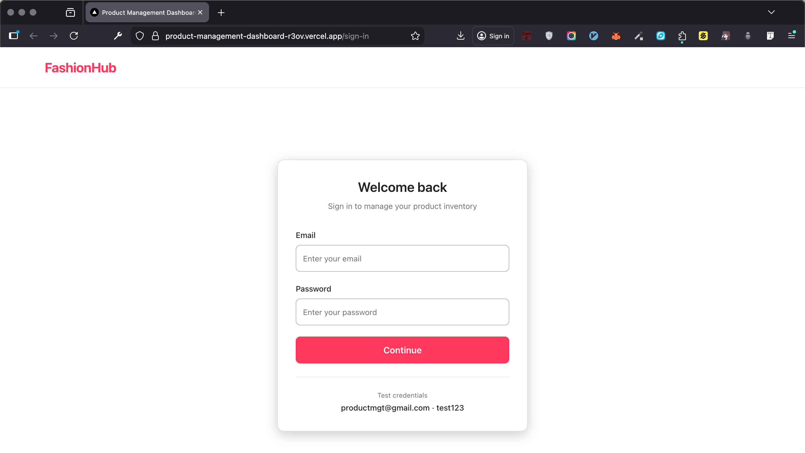
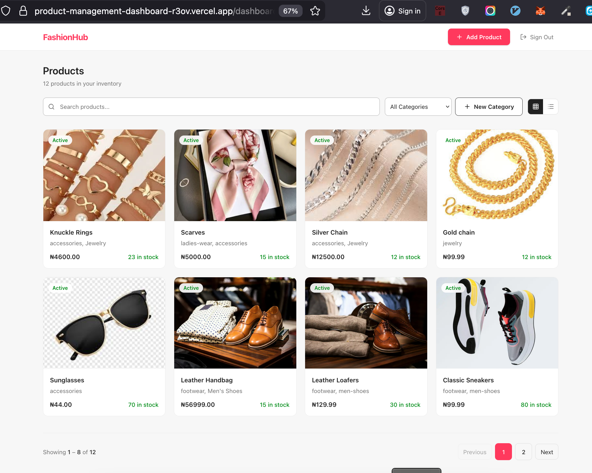
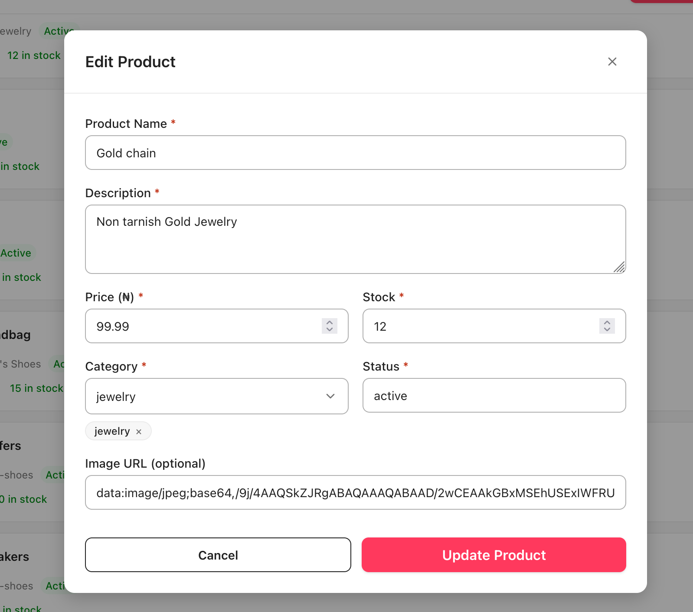
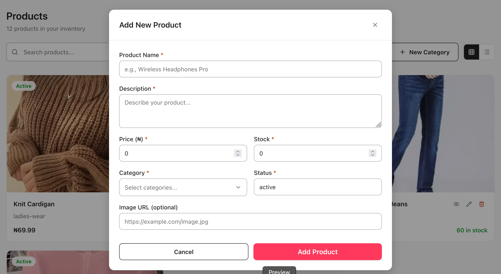
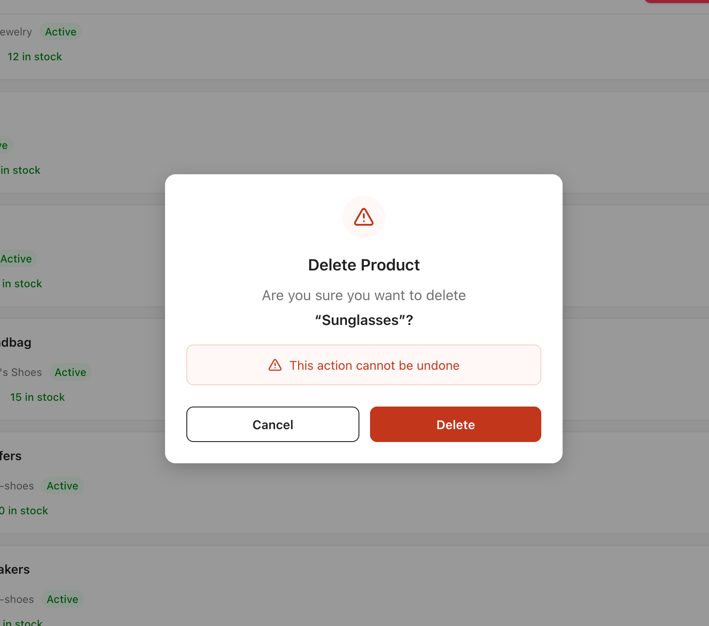
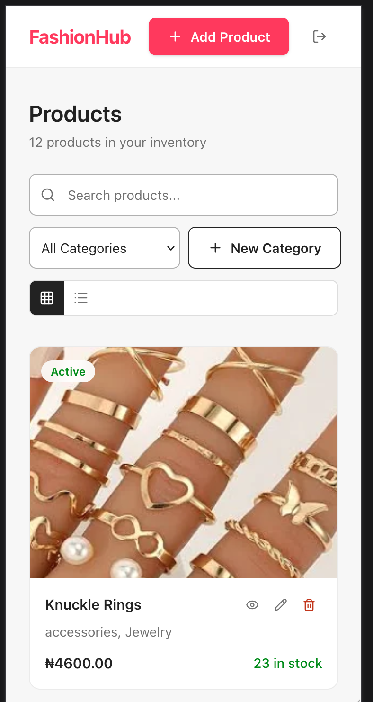
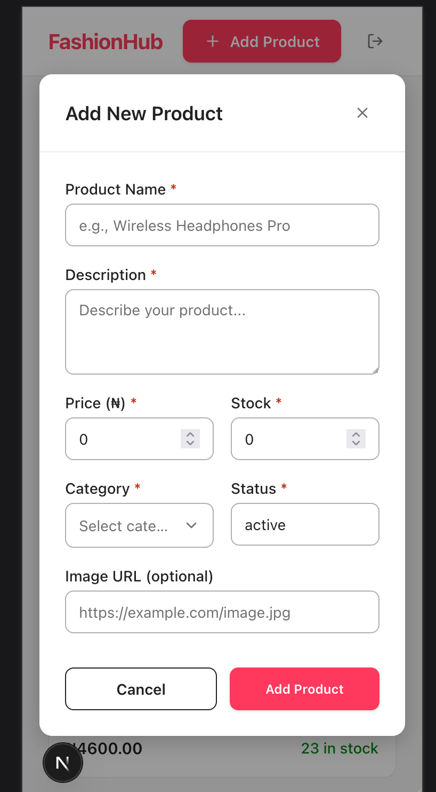
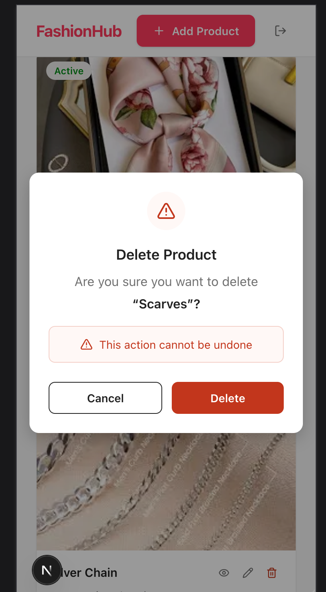

# FashionHub-Product Management Dashboard

A full-featured product management dashboard built with **Next.js 15**, **TypeScript**, and **Tailwind CSS**. Users can view, search, filter, create, edit, and delete products through an intuitive, responsive UI with real-time data powered by Supabase.

##Features

- **Product List** : Grid and list view toggle with product cards showing name, price, stock, status, and image
- **Pagination** : Server-side pagination with page numbers, previous/next navigation, and smart ellipsis
- **Search** — Debounced (300ms) search by product name to minimize unnecessary API calls
- **Category Filtering** : Filter products by category via dropdown; supports multi-category products
- **Create / Edit Modal** : Shared modal form for adding new products and editing existing ones
- **Delete Confirmation** : Confirmation dialog with clear warning before permanently removing a product
- **Product Details** : Read-only detail modal showing full product information
- **Form Validation** : Schema-based validation using Zod with inline error messages
- **Authentication** : Sign-in flow with Supabase Auth and protected dashboard route
- **Responsive Design** : Fully responsive layout across mobile, tablet, and desktop
- **Accessibility** : ARIA attributes, focus management, keyboard navigation, semantic HTML

## Screenshots

### Login Page


### Dashboard


### Edit Product


### Add Product


### Delete Product


### Mobile View


## Add Mobile View


## Delete Mobile View


## Tech Stack

| Layer | Technology |
| Framework | [Next.js 15](https://nextjs.org/) (App Router) |
| Language | [TypeScript](https://www.typescriptlang.org/) |
| Styling | [Tailwind CSS v4](https://tailwindcss.com/) |
| Data Fetching | [TanStack React Query v5](https://tanstack.com/query) |
| Forms | [React Hook Form v7](https://react-hook-form.com/) + [Zod v4](https://zod.dev/) |
| Auth | [Supabase Auth](https://supabase.com/docs/guides/auth) |
| API | [Supabase REST API](https://supabase.com/docs/guides/api) (PostgREST) |
| Icons | [Lucide React](https://lucide.dev/) |

---

##Project Structure

```
├── app/
│   ├── page.tsx                  # Root — redirects to /sign-in or /dashboard
│   ├── sign-in/page.tsx          # Sign-in page
│   ├── dashboard/page.tsx        # Main dashboard (protected)
│   ├── layout.tsx                # Root layout with providers
│   └── globals.css               # Global styles
├── components/
│   ├── ui/                       # Reusable primitives
│   │   ├── button.tsx
│   │   ├── input.tsx
│   │   ├── textarea.tsx
│   │   └── modal.tsx
│   ├── products/                 # Product-specific components
│   │   ├── product-card.tsx      # Grid & list card (React.memo)
│   │   ├── product-form.tsx      # Create/Edit form modal
│   │   ├── product-details.tsx   # Read-only detail modal
│   │   └── delete-confirmation.tsx
│   └── categories/
│       └── category-form.tsx     # Category creation modal
├── lib/
│   ├── api/products.ts           # REST API client (fetch)
│   ├── hooks/
│   │   ├── useProducts.ts        # React Query hooks (CRUD + categories)
│   │   └── useDebounce.ts        # Debounce hook for search
│   ├── contexts/auth-context.tsx # Auth context provider
│   ├── providers.tsx             # QueryClient + Auth providers
│   ├── validations/product.ts    # Zod form schemas
│   ├── supabase.ts               # Supabase client instance
│   └── utils.ts                  # cn() utility (clsx + tailwind-merge)
├── types/
│   └── product.ts                # TypeScript interfaces
└── public/                       # Static assets
```

##Getting Started

### Prerequisites

- **Node.js** ≥ 18 (tested on v22)
- **npm** (comes with Node.js)
- A **Supabase** project with `products` and `categories` tables

### 1. Clone the repository

```bash
git clone https://github.com/<your-username>/product-management-dashboard.git
cd product-management-dashboard
```

### 2. Install dependencies

```bash
npm install
```

### 3. Set up environment variables

Create a `.env.local` file in the project root:

```env
NEXT_PUBLIC_SUPABASE_URL=https://your-project.supabase.co
NEXT_PUBLIC_SUPABASE_ANON_KEY=your-supabase-anon-key
```

You can find these values in your Supabase project dashboard under **Settings → API**.

### 4. Set up the database

Create the following tables in your Supabase project:

**Products table:**

| Column | Type | Notes |
| id | int8 (primary key) | Auto-generated |
| name | text | Required |
| description | text | Required |
| price | float8 | Required |
| category | text | Required |
| stock | int4 | Required |
| status | text | Required |
| image | text | Optional (URL) |
| created_at | timestamptz | Default: `now()` |

**Categories table:**

| Column | Type | Notes |
|---|---|---|
| id | int8 (primary key) | Auto-generated |
| name | text | Required |
| slug | text | Optional |
| status | text | Default: `active` |
| created_at | timestamptz | Default: `now()` |

### 5. Run the development server

```bash
npm run dev
```

Open https://product-management-dashboard-r3ov.vercel.app/ — you'll be redirected to the sign-in page.

### 6. Build for production

```bash
npm run build
npm start
```

---

## Test Credentials

| Field | Value |
| Email | `productmgt@gmail.com` |
| Password | `test123` |

These are displayed on the sign-in page for convenience.

## Technical Decisions

### Why Supabase REST API instead of a mock API?

The assessment allows mock APIs, but using Supabase gives a **real PostgreSQL database** with proper CRUD persistence, server-side pagination via `content-range` headers, and built-in authentication, making the project more realistic and production-like, then mockapi.io requires subscription, whereas Supabase is free. 

### Why React Query over Redux or Context for data?

React Query is purpose-built for **server state management**: it handles caching, background refetching, optimistic updates, and loading/error states out of the box. Redux would add unnecessary boilerplate for a data-fetching use case. Context API is used separately for **client state** (authentication).

### Why Zod + React Hook Form?

Zod provides **type-safe schema validation** that integrates seamlessly with TypeScript. Paired with React Hook Form, it delivers performant forms (no unnecessary re-renders) with automatic type inference from the schema, write the schema once, get validation + types for free.

### Why `useCallback` + `React.memo` on product cards?

The dashboard holds ~12 state variables. Without memoization, every state change (opening a modal, typing in search) would re-render all product cards. `React.memo` on `ProductCard` + `useCallback` on handlers ensures cards only re-render when their actual data changes.

### Why debounced search?

Firing an API request on every keystroke would create unnecessary network traffic and Supabase load. The 300ms debounce (`useDebounce` hook) waits for the user to pause typing before sending the query, while keeping the input responsive with immediate visual feedback.

### Routing & Auth flow

The root route (`/`) checks auth state and redirects: unauthenticated users go to `/sign-in`, authenticated users go to `/dashboard`. This ensures the **sign-in page is always the first thing new users see**, no flash of protected content.

## License

This project was built as a frontend technical assessment.
